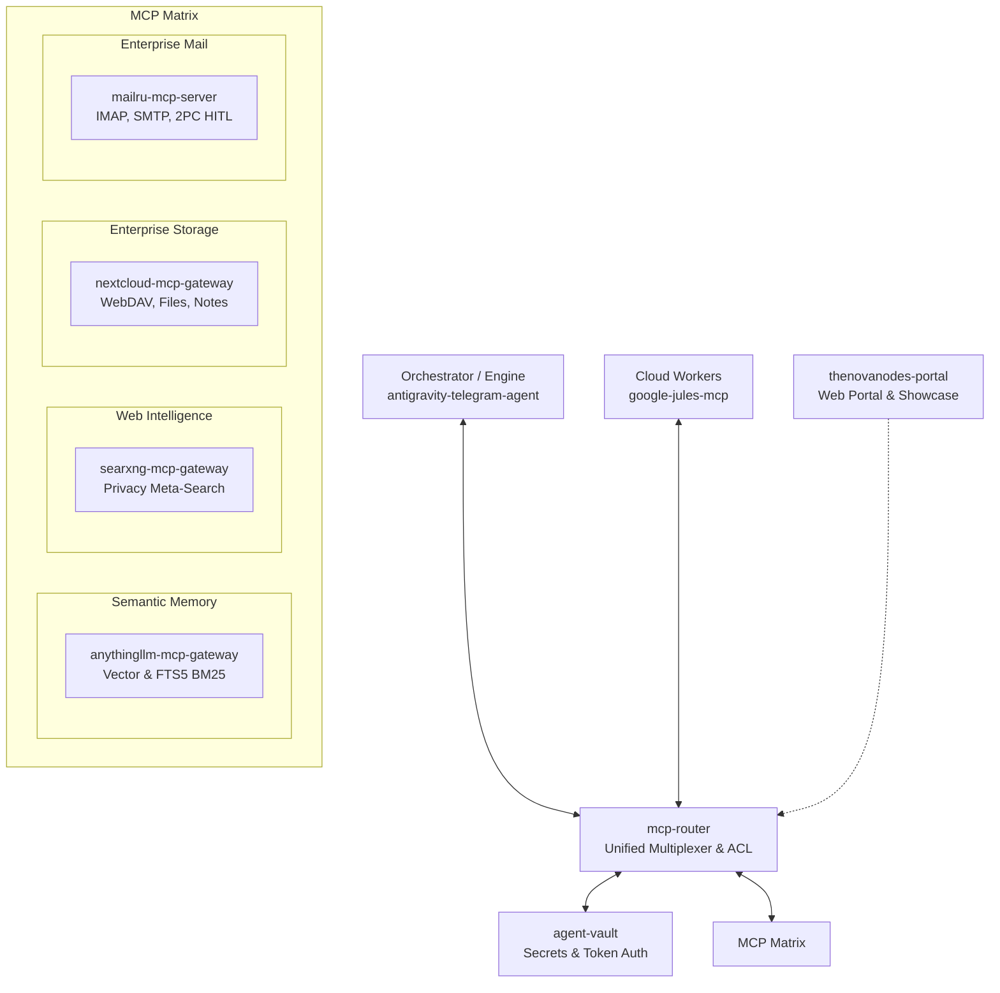

# TheNovaNodes 🌌

  

## What is TheNovaNodes?
TheNovaNodes is a modular upgrade layer and infrastructure suite for AI agent systems. It provides independent capabilities through the Model Context Protocol (MCP), HTTP, CLI, and high-performance native engines (Go / Python) to augment your existing agentic workflows.

## What problem does the modular layer solve?
Instead of a monolithic, one-size-fits-all solution, TheNovaNodes allows developers to selectively integrate individual tools, gateways, and control planes into their existing setups. It decouples orchestrators, high-speed routing engines, cloud workers, and storage layers so you can build scalable, resilient agent networks without vendor lock-in.

## Which capabilities are available?
We offer modular capabilities across key infrastructure domains:
- **Routing & Access Control**: Unified MCP Router and multiplexer with strict ACL enforcement ([`mcp-router`](https://github.com/TheNovaNodes/mcp-router)).
- **Orchestration & High-Speed Engines**: Pure Go multi-agent swarm engine with streaming PTY output and deadlock immunity ([`antigravity-telegram-agent`](https://github.com/TheNovaNodes/antigravity-telegram-agent)).
- **Cloud Workers**: Asynchronous task execution and PR generation ([`google-jules-mcp`](https://github.com/TheNovaNodes/google-jules-mcp)).
- **Semantic Memory**: Hybrid vector and FTS5 BM25 retrieval gateway for AnythingLLM ([`anythingllm-mcp-gateway`](https://github.com/TheNovaNodes/anythingllm-mcp-gateway)).
- **Web Intelligence**: Privacy-focused meta-search for real-time agent research ([`searxng-mcp-gateway`](https://github.com/TheNovaNodes/searxng-mcp-gateway)).
- **Enterprise Storage & CRM**: WebDAV file storage, calendars, notes, and user cloud synchronization ([`nextcloud-mcp-gateway`](https://github.com/TheNovaNodes/nextcloud-mcp-gateway)).
- **Enterprise Mail**: Production-grade Mail.ru integration in Go with Two-Phase Commit human-in-the-loop controls ([`mailru-mcp-server`](https://github.com/TheNovaNodes/mailru-mcp-server)).
- **Security & Secret Vaults**: Zero-trust credential isolation and token management daemon ([`agent-vault`](https://github.com/TheNovaNodes/agent-vault)).
- **Showcase & Web Portal**: Interactive web portal and visual ecosystem hub ([`thenovanodes-portal`](https://github.com/TheNovaNodes/thenovanodes-portal)).

## How can a user start with one module?
Through our **"Choose Your Upgrade"** onboarding, you can adopt just a single repository. For instance, if you only need web search for your AI, you can spin up `searxng-mcp-gateway` and connect it to your preferred orchestrator without adopting the rest of the stack.

## What is verified today and what remains experimental?
- **Verified**: All 9 core public MCP gateways, `mcp-router`, `agent-vault`, the Pure Go swarm engine `antigravity-telegram-agent`, and the interactive portal `thenovanodes-portal` are verified for production and local usage.
- **Experimental**: Cross-domain autonomous multi-agent consensus loops, complex autonomous federation meshes, and real-time swarm failover protocols remain in active R&D.

---

## Architecture

TheNovaNodes uses a decoupled, topology-agnostic architecture. High-performance agent runtimes communicate with workers and the MCP Matrix through the `mcp-router` and isolated secret daemon (`agent-vault`).

  

---

## Capability Matrix

| Domain | Architecture Layer | Public Repository | Key Highlights |
|---|---|---|---|
| **Routing & Multiplexing** | Gateway / ACL | [`mcp-router`](https://github.com/TheNovaNodes/mcp-router) | High-performance Go MCP router, dynamic multiplexing, path-based ACL |
| **Swarm Engine & Telegram** | Orchestration | [`antigravity-telegram-agent`](https://github.com/TheNovaNodes/antigravity-telegram-agent) | Pure Go swarm engine, PTY streaming, deadlock-immune watchdog |
| **Security & Secrets** | Auth & Vault | [`agent-vault`](https://github.com/TheNovaNodes/agent-vault) | Zero-trust token auth daemon, in-memory credential storage, opaque pointers |
| **Cloud Worker** | Distributed Coding | [`google-jules-mcp`](https://github.com/TheNovaNodes/google-jules-mcp) | Model Context Protocol gateway for asynchronous Google Jules tasks |
| **Semantic Memory** | Data Plane / RAG | [`anythingllm-mcp-gateway`](https://github.com/TheNovaNodes/anythingllm-mcp-gateway) | Go MCP gateway for AnythingLLM, hybrid vector & FTS5 BM25 retrieval |
| **Web Intelligence** | Research Gateway | [`searxng-mcp-gateway`](https://github.com/TheNovaNodes/searxng-mcp-gateway) | Privacy-focused meta-search for real-time autonomous research |
| **Enterprise Storage & CRM** | Data Plane / WebDAV | [`nextcloud-mcp-gateway`](https://github.com/TheNovaNodes/nextcloud-mcp-gateway) | WebDAV file storage, calendar, contacts, deck boards, user files |
| **Enterprise Mail** | Mail Protocols | [`mailru-mcp-server`](https://github.com/TheNovaNodes/mailru-mcp-server) | IMAP, SMTP, WebDAV, CardDAV with Two-Phase Commit HITL |
| **Showcase & Portal** | Presentation Layer | [`thenovanodes-portal`](https://github.com/TheNovaNodes/thenovanodes-portal) | Official web portal and interactive showcase for the infrastructure suite |

---

## Choose Your Upgrade (Onboarding)

You don't need to adopt the entire suite. Choose what fits your needs:
1. **Need an Autonomous Orchestrator?** Deploy [antigravity-telegram-agent](https://github.com/TheNovaNodes/antigravity-telegram-agent) for a pure Go swarm engine with streaming PTY output and watchdog recovery.
2. **Need MCP Multiplexing & Access Control?** Deploy [mcp-router](https://github.com/TheNovaNodes/mcp-router) to unite multiple MCP servers behind a single, secure multiplexer.
3. **Need Zero-Trust Secret Isolation?** Run [agent-vault](https://github.com/TheNovaNodes/agent-vault) to prevent API keys and credentials from leaking into LLM prompt contexts.
4. **Need Asynchronous Cloud Workers?** Connect [google-jules-mcp](https://github.com/TheNovaNodes/google-jules-mcp) for autonomous coding branches and PR workflows.
5. **Need Tools, Search, Storage, or Mail?** Spin up any of our specialized MCP gateways ([anythingllm-mcp-gateway](https://github.com/TheNovaNodes/anythingllm-mcp-gateway), [searxng-mcp-gateway](https://github.com/TheNovaNodes/searxng-mcp-gateway), [nextcloud-mcp-gateway](https://github.com/TheNovaNodes/nextcloud-mcp-gateway), or [mailru-mcp-server](https://github.com/TheNovaNodes/mailru-mcp-server)).
6. **Want to Explore the Web UI?** Visit [thenovanodes-portal](https://github.com/TheNovaNodes/thenovanodes-portal) for the visual architecture showcase.

---

## Security Model

TheNovaNodes prioritizes secure, zero-trust access models.
- **Credential Isolation:** All API keys and sensitive tokens are managed out-of-process via `agent-vault` (`http://localhost:8301`).
- **Network Boundaries:** MCP gateways run locally or behind tight API header authentication and ACL rules provided by `mcp-router`.
- **Review & Quality:** Code changes undergo strict peer review, local and CI test suites before landing on main branches.

---

## Repository Groups

### Core Orchestration & Engines
- **[antigravity-telegram-agent](https://github.com/TheNovaNodes/antigravity-telegram-agent)**: Autonomous Google Antigravity CLI Telegram Agent with PTY Streaming & 6-Pack MCP Matrix in Pure Go.
- **[google-jules-mcp](https://github.com/TheNovaNodes/google-jules-mcp)**: Integration module for Google Jules cloud workers via Model Context Protocol.

### Infrastructure, Routing & Security
- **[mcp-router](https://github.com/TheNovaNodes/mcp-router)**: High-performance unified MCP Gateway, Router, and Multiplexer with ACL support in Go.
- **[agent-vault](https://github.com/TheNovaNodes/agent-vault)**: Ultra-lightweight, in-memory secret manager and token auth daemon for AI agent fleets.

### Data Plane & Knowledge Gateways
- **[anythingllm-mcp-gateway](https://github.com/TheNovaNodes/anythingllm-mcp-gateway)**: High-performance Go MCP gateway for AnythingLLM with Hybrid Vector & FTS5 BM25 search.
- **[searxng-mcp-gateway](https://github.com/TheNovaNodes/searxng-mcp-gateway)**: Privacy-focused web search MCP gateway for real-time AI agent research.
- **[nextcloud-mcp-gateway](https://github.com/TheNovaNodes/nextcloud-mcp-gateway)**: Nextcloud Data Plane MCP server (WebDAV, Files, Notes, CRM & User Cloud Storage).
- **[mailru-mcp-server](https://github.com/TheNovaNodes/mailru-mcp-server)**: Production-grade MCP server for Mail.ru (IMAP, SMTP, WebDAV) in Go with Two-Phase Commit HITL.

### Presentation & Portals
- **[thenovanodes-portal](https://github.com/TheNovaNodes/thenovanodes-portal)**: Official Web Portal & Interactive Showcase for TheNovaNodes AI Agent Infrastructure Suite.

---

## Status & Governance
- **Modularity:** High. Every public module can run independently or connected through `mcp-router`.
- **Maturity:** Core public MCP gateways, `mcp-router`, `agent-vault`, and `antigravity-telegram-agent` are verified for production usage.
- **Ecosystem Governance:** Core infrastructure repositories are open source under the MIT License. Enterprise and telemetry products (`fxlab-landing`, `nova-pulse`, `ecosystem-docs`) are maintained under organization governance.

---

## Support TheNovaNodes

If this modular agent infrastructure is useful to you, you can support its open-source development.

**USDT (TRC20):** `TQvw8MJMdSBFXu5G74JsZm1gzg7cuXBZ2o`
