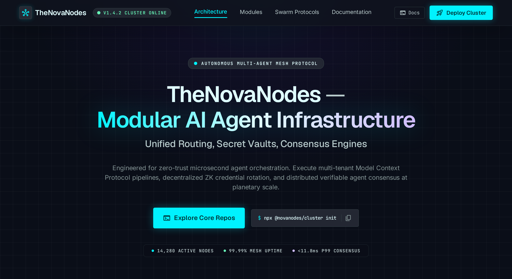
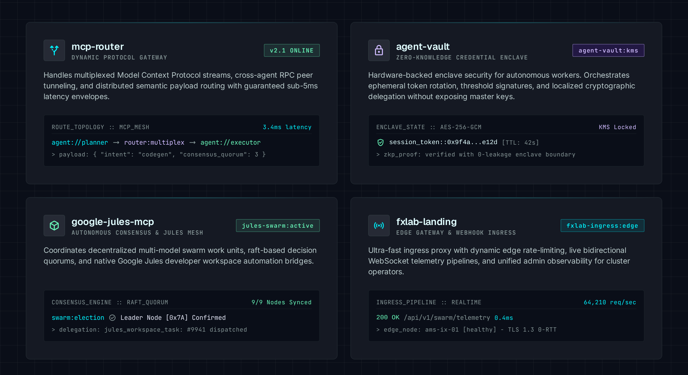

# TheNovaNodes 🌌

<p align="center">
  
</p>

## What is TheNovaNodes?
TheNovaNodes is a modular upgrade layer and infrastructure suite for AI agent systems. It provides independent capabilities through the Model Context Protocol (MCP), HTTP, CLI, and high-performance native engines (Go / Python) to augment your existing agentic workflows.

## What problem does the modular layer solve?
Instead of a monolithic, one-size-fits-all solution, TheNovaNodes allows developers to selectively integrate individual tools, gateways, and control planes into their existing setups. It decouples orchestrators, high-speed routing engines, cloud workers, and storage layers so you can build scalable, resilient agent networks without vendor lock-in.

## Which capabilities are available?
We offer modular capabilities across key infrastructure domains:
- **Routing & Access Control**: Unified MCP Router and multiplexer with strict ACL enforcement (`mcp-router`).
- **Orchestration & High-Speed Engines**: Native Go agent runtimes (`antigravity-go-tg-bot-agent`), Telegram PTY interfaces, and consensus gates (`google-jules-stitch-gate`).
- **Semantic Memory**: Hybrid search and vector knowledge retrieval via AnythingLLM gateways.
- **Web Intelligence**: Privacy-focused meta-search and research access via SearXNG.
- **Enterprise CRM, Mail & Storage**: Full WebDAV, IMAP/CardDAV, and cloud file integration (Nextcloud & Mail.ru MCPs).
- **Security & Secret Vaults**: Zero-trust credential isolation using `agent-vault` and automated PR security reviewers (`mcp-gh-pr-reviewer`).

## How can a user start with one module?
Through our **"Choose Your Upgrade"** onboarding, you can adopt just a single repository. For instance, if you only need web search for your AI, you can spin up `searxng-mcp-gateway` and connect it to your preferred orchestrator without adopting the rest of the stack.

## What is verified today and what remains experimental?
- **Verified**: Individual Data Plane MCP gateways, Control Plane modules, `agent-vault`, and `mcp-router` ACL implementations are verified for production and local usage.
- **Experimental**: Multi-agent consensus clustering (`google-jules-stitch-gate`), cross-domain autonomous agent loops, and multi-layered worker architectures remain in active evolution.

---

## Architecture

TheNovaNodes uses a decoupled, topology-agnostic architecture. High-performance agent runtimes communicate with workers and the MCP Matrix through the `mcp-router` and isolated secret daemon (`agent-vault`).

```mermaid
flowchart TD
    Orch[Orchestrator / Engine\n(e.g., antigravity-go-tg-bot-agent)]
    Router[mcp-router\n(Unified Multiplexer & ACL)]
    Worker[Cloud Workers\n(e.g., google-jules-mcp)]
    Gate[google-jules-stitch-gate\n(Consensus Cluster)]

    Orch <--> Router
    Worker <--> Router
    Orch <--> Gate
    
    Router <--> Vault[agent-vault\n(Secrets & Credentials)]
    Router <--> MCP[MCP Matrix]

    subgraph MCP Matrix
        subgraph Memory
            A_G[anythingllm-mcp-gateway]
            A_C[anythingllm-mcp-control]
        end
        subgraph Web
            S_G[searxng-mcp-gateway]
            S_C[searxng-mcp-control]
        end
        subgraph Enterprise & Mail
            N_G[nextcloud-mcp-gateway]
            N_C[nextcloud-mcp-control]
            M_S[mailru-mcp-server]
        end
        subgraph Security
            PR_R[mcp-gh-pr-reviewer]
        end
    end
```

<p align="center">
  
</p>

---

## Capability Matrix

| Domain | Data Plane (Read / Gateway) | Control Plane (Write / Admin / Routing) |
|---|---|---|
| **Routing & ACL** | mcp-router | mcp-router |
| **Semantic Memory** | anythingllm-mcp-gateway | anythingllm-mcp-control |
| **Web Intelligence** | searxng-mcp-gateway | searxng-mcp-control |
| **Enterprise CRM & Mail** | nextcloud-mcp-gateway, mailru-mcp-server | nextcloud-mcp-control |
| **Security & Secrets** | agent-vault, mcp-gh-pr-reviewer | agent-vault |
| **Consensus & Multi-Agent** | google-jules-stitch-gate | google-jules-stitch-gate |

---

## Choose Your Upgrade (Onboarding)

You don't need to adopt the entire suite. Choose what fits your needs:
1. **Need an Orchestrator / High-Speed Engine?** Explore: [antigravity-cli-telegram-bot](https://github.com/TheNovaNodes/antigravity-cli-telegram-bot) or [antigravity-telegram-agent](https://github.com/TheNovaNodes/antigravity-telegram-agent).
2. **Need MCP Multiplexing & Access Control?** Deploy: [mcp-router](https://github.com/TheNovaNodes/mcp-router).
3. **Need a Cloud Worker?** Integrate: [google-jules-mcp](https://github.com/TheNovaNodes/google-jules-mcp).
4. **Need Tools, Mail or Storage?** Spin up one of our MCP gateways or controls (see Repository Groups below) or securely manage credentials with [agent-vault](https://github.com/TheNovaNodes/agent-vault).

---

## Security Model

TheNovaNodes prioritizes secure, zero-trust access models.
- **Credential Isolation:** All API keys and sensitive tokens are managed out-of-process via `agent-vault` (`http://localhost:8301`).
- **Network Boundaries:** MCP gateways run locally or behind tight API header authentication and ACL rules provided by `mcp-router`.
- **Auditing:** Code changes and PRs undergo automated verification via `mcp-gh-pr-reviewer`.

---

## Repository Groups

### Orchestration, Engines & Workers
- **[antigravity-cli-telegram-bot](https://github.com/TheNovaNodes/antigravity-cli-telegram-bot)**: Pure Go Engine & Python Fallback Layer for Antigravity AI Telegram Agents.
- **[antigravity-telegram-agent](https://github.com/TheNovaNodes/antigravity-telegram-agent)**: Autonomous Google Antigravity CLI Telegram Agent with PTY Streaming & 6-Pack MCP Matrix.
- **[google-jules-mcp](https://github.com/TheNovaNodes/google-jules-mcp)**: Integration module for Google Jules cloud workers.
- **[google-jules-stitch-gate](https://github.com/TheNovaNodes/google-jules-stitch-gate)**: Multi-agent quality gate and consensus cluster.

### Infrastructure & Security
- **[agent-vault](https://github.com/TheNovaNodes/agent-vault)**: Secure credential and secrets management daemon for AI agents.
- **[mcp-router](https://github.com/TheNovaNodes/mcp-router)**: High-performance unified MCP Router and Multiplexer with ACL support.
- **[mcp-gh-pr-reviewer](https://github.com/TheNovaNodes/mcp-gh-pr-reviewer)**: Universal MCP Server for automated GitHub Pull Request security reviews.

### Semantic Memory
- **[anythingllm-mcp-gateway](https://github.com/TheNovaNodes/anythingllm-mcp-gateway)**: Connects LLMs to internal knowledge bases.
- **[anythingllm-mcp-control](https://github.com/TheNovaNodes/anythingllm-mcp-control)**: Manages AnythingLLM workspaces and threads.

### Web Intelligence
- **[searxng-mcp-gateway](https://github.com/TheNovaNodes/searxng-mcp-gateway)**: Privacy-focused web search for real-time agent research.
- **[searxng-mcp-control](https://github.com/TheNovaNodes/searxng-mcp-control)**: Administers SearXNG settings.

### Enterprise CRM & Mail
- **[nextcloud-mcp-gateway](https://github.com/TheNovaNodes/nextcloud-mcp-gateway)**: Allows agents to read WebDAV, files, and notes.
- **[nextcloud-mcp-control](https://github.com/TheNovaNodes/nextcloud-mcp-control)**: Manages Nextcloud users and permissions.
- **[mailru-mcp-server](https://github.com/TheNovaNodes/mailru-mcp-server)**: Stateless MCP server for Mail.ru (IMAP, WebDAV, CardDAV) agentic workflows.

---

## Status & Limitations
- **Modularity:** High. You can use any module independently.
- **Maturity:** The data plane MCP gateways, `agent-vault`, and `mcp-router` are verified for production usage; multi-agent consensus loops are experimental.
- **Limitations:** Certain control plane modules require elevated privileges to the underlying services (e.g., Nextcloud admin credentials), so careful deployment is required.

---

## Support TheNovaNodes

If this modular agent infrastructure is useful to you, you can support its open-source development.

**USDT (TRC20):** `TQvw8MJMdSBFXu5G74JsZm1gzg7cuXBZ2o`
